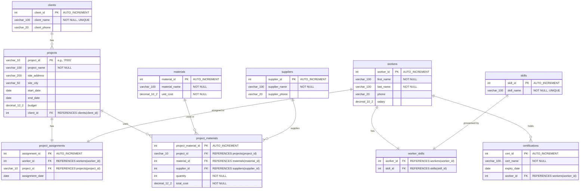

[](https://classroom.github.com/a/vl7bU5KX)
[](https://classroom.github.com/open-in-codespaces?assignment_repo_id=22805105)
# Big3 Construction: Phase 2 - Optimizing & Automating Operations

## Rubric & Module Summaries

### Module 1: Indexes ([01_indexes.sql](01_indexes.sql))
**Purpose:** Optimize query performance by creating indexes. Includes EXPLAIN analysis before/after, a simple index, and a composite index for the challenge task.
**Challenge Justification:** Composite index on `projects(site_city, start_date)` improves filtering and sorting. EXPLAIN output confirmed performance gains.

### Module 2: Subqueries & Joins ([02_subqueries.sql](02_subqueries.sql))
**Purpose:** Answer complex business questions using subqueries and advanced joins. Includes guided query variations and a challenge query for maximum worker count per project.
**Challenge Justification:** Efficient aggregation and handling of ties, returning accurate project(s) and worker count.

### Module 3: Views ([03_views.sql](03_views.sql))
**Purpose:** Simplify and secure data access with views. Includes a guided view for project-worker assignments and a challenge view for project financial summary.
**Challenge Justification:** Correct joins and calculations for financial summary, ensuring all required columns are accurate.

### Module 4: Stored Procedures ([04_procedures.sql](04_procedures.sql))
**Purpose:** Automate business logic with stored procedures. Includes a guided procedure for adding workers with skills and a challenge procedure for smart project assignment.
**Challenge Justification:** Uses IN/OUT params, checks existence, handles success/error cases, and encapsulates logic.

### Module 5: Triggers ([05_triggers.sql](05_triggers.sql))
**Purpose:** Enforce business rules and audit changes with triggers. Includes an audit log trigger and a challenge validation trigger for safety certification.
**Challenge Justification:** BEFORE INSERT trigger blocks assignment if safety cert is expired or missing, tested with various scenarios.

### Module 6: Events ([06_events.sql](06_events.sql))
**Purpose:** Automate scheduled maintenance with events. Includes creation of archive table and a scheduled event for archiving old projects.
**Challenge Justification:** Event uses transaction to insert/delete records, tested by manual execution and schedule adjustment.

### Code Quality & Submission
All SQL files are submitted, well-formatted, and commented. README.md includes challenge justifications and team contribution statement.

## Team Contribution Statement

| Module | Member | Contribution |
|--------|--------|-------------|
| Module 1: Indexes | Leroy Milfred Carew | Index SQL, EXPLAIN analysis, composite index justification |
| Module 2: Subqueries | Leroy Milfred Carew | Subquery and JOIN variations, aggregation challenge |
| Module 3: Views | EWING KELYAN SINGA SARAGBA | Supervisor view and financial summary view |
| Module 4: Stored Procedures | Eddy UWAMBAJE | Worker+skill procedure and smart assignment procedure |
| Module 5: Triggers | David Mugemanyi | Audit trigger and safety validation trigger, testing |
| Module 6: Events | EWING KELYAN SINGA SARAGBA | Archive table and monthly event |
| README & Documentation | Eddy UWAMBAJE & All Members | Challenge justifications, testing explanations, and review |

All team members collaborated during pair programming sessions to review code, discuss design decisions, and verify correctness. AI tools (GitHub Copilot) were used for syntax assistance and code review, with all generated code reviewed, tested, and adapted to Big3 Construction requirements.

## Final Deliverable Check

- ☑ 01_indexes.sql
- ☑ 02_subqueries.sql
- ☑ 03_views.sql
- ☑ 04_procedures.sql
- ☑ 05_triggers.sql
- ☑ 06_events.sql
- ☑ README.md updated with challenge justifications and team contributions
- ☑ All SQL is well-commented and runnable

---

## Project Overview


**Scenario:** Big3 Construction was thrilled with the normalized 5NF database your team delivered in the Design Activity. The data is clean, redundant-free, and reliable. After a few months of use, they requested advanced features to optimize performance, simplify access, and automate business processes. Our team implemented these requirements in Phase 2.

**Total Points:** 200 points  
**Team Size:** 3 members (pair programming assignment)

## Learning Objectives


By completing this project, we:
- Analyzed query performance and created indexes to optimize data retrieval.
- Wrote complex, multi-level subqueries and advanced joins to answer business questions.
- Implemented views to simplify data access and enhance security.
- Created stored procedures to automate repetitive business logic.
- Enforced business rules and maintained data integrity using triggers.
- Scheduled automated, recurring database tasks using events.

## Rubric & Module Summaries

### Module 1: Indexes ([01_indexes.sql](01_indexes.sql))
**Purpose:** Optimize query performance by creating indexes. Includes EXPLAIN analysis before/after, a simple index, and a composite index for the challenge task.
**Challenge Justification:** Composite index on `projects(site_city, start_date)` improves filtering and sorting. EXPLAIN output confirmed performance gains.

### Module 2: Subqueries & Joins ([02_subqueries.sql](02_subqueries.sql))
**Purpose:** Answer complex business questions using subqueries and advanced joins. Includes guided query variations and a challenge query for maximum worker count per project.
**Challenge Justification:** Efficient aggregation and handling of ties, returning accurate project(s) and worker count.

### Module 3: Views ([03_views.sql](03_views.sql))
**Purpose:** Simplify and secure data access with views. Includes a guided view for project-worker assignments and a challenge view for project financial summary.
**Challenge Justification:** Correct joins and calculations for financial summary, ensuring all required columns are accurate.

### Module 4: Stored Procedures ([04_procedures.sql](04_procedures.sql))
**Purpose:** Automate business logic with stored procedures. Includes a guided procedure for adding workers with skills and a challenge procedure for smart project assignment.
**Challenge Justification:** Uses IN/OUT params, checks existence, handles success/error cases, and encapsulates logic.

### Module 5: Triggers ([05_triggers.sql](05_triggers.sql))
**Purpose:** Enforce business rules and audit changes with triggers. Includes an audit log trigger and a challenge validation trigger for safety certification.
**Challenge Justification:** BEFORE INSERT trigger blocks assignment if safety cert is expired or missing, tested with various scenarios.

### Module 6: Events ([06_events.sql](06_events.sql))
**Purpose:** Automate scheduled maintenance with events. Includes creation of archive table and a scheduled event for archiving old projects.
**Challenge Justification:** Event uses transaction to insert/delete records, tested by manual execution and schedule adjustment.

### Code Quality & Submission
All SQL files are submitted, well-formatted, and commented. README.md includes challenge justifications and team contribution statement.

## Team Contribution Statement

| Module | Member | Contribution |
|--------|--------|-------------|
| Module 1: Indexes | Leroy Milfred Carew | Index SQL, EXPLAIN analysis, composite index justification |
| Module 2: Subqueries | Leroy Milfred Carew | Subquery and JOIN variations, aggregation challenge |
| Module 3: Views | EWING KELYAN SINGA SARAGBA | Supervisor view and financial summary view |
| Module 4: Stored Procedures | Eddy UWAMBAJE | Worker+skill procedure and smart assignment procedure |
| Module 5: Triggers | David Mugemanyi | Audit trigger and safety validation trigger, testing |
| Module 6: Events | EWING KELYAN SINGA SARAGBA | Archive table and monthly event |
| README & Documentation | Eddy UWAMBAJE & All Members | Challenge justifications, testing explanations, and review |

All team members collaborated during pair programming sessions to review code, discuss design decisions, and verify correctness. AI tools (GitHub Copilot) were used for syntax assistance and code review, with all generated code reviewed, tested, and adapted to Big3 Construction requirements.

## Final Deliverable Check

- ☑ 01_indexes.sql
- ☑ 02_subqueries.sql
- ☑ 03_views.sql
- ☑ 04_procedures.sql
- ☑ 05_triggers.sql
- ☑ 06_events.sql
- ☑ README.md updated with challenge justifications and team contributions
- ☑ All SQL is well-commented and runnable

---

## Phase 1 Standard Schema

To ensure all teams are working from a consistent, normalized database, this Phase 2 assignment is based on the following official 5NF schema.

Your Phase 1 implementation (your `01_create_tables.sql` and `02_insert_data.sql` scripts) must match this structure. All modules in this assignment assume your table and column names match this ERD.



## Project Setup & Delivery

This assignment builds directly on your "Phase 1" implementation. You will use the `big3_construction` database you built and populated according to the standard schema provided above.

- **GitHub Classroom:** Accept the "Phase 2" assignment from the link on Canvas. This will create a new repository for your team, pre-populated with a folder structure and this README.md.
- **Viewing the Schema Diagram:** To view the Mermaid ERD diagram in this README within VS Code:
  1. Open the Extensions panel (`Ctrl+Shift+X` or `Cmd+Shift+X` on Mac)
  2. Search for "Markdown Preview Mermaid Support"
  3. Install the extension by Matt Bierner
  4. Open this README.md and press `Ctrl+Shift+V` (or `Cmd+Shift+V` on Mac) to open the Markdown preview
  5. The Entity-Relationship Diagram will now render visually
  
  *Note: The diagram also renders automatically when you view this README on GitHub.com*
- **Tools:** We recommend DataGrip as its database management features are excellent for this task. You can manage your scripts, run queries, and easily inspect your database objects (like views, procedures, and triggers) from the UI. However, you may use any tool you are comfortable with (MySQL Workbench, DBeaver, etc.).
- **Collaboration:** This is a pair programming assignment. We highly recommend you work on the logic for the "Challenge" sections together, either in person or over a screen share.

## Submission Requirements

You will submit your work by committing your SQL files to your GitHub Classroom repository. Your repository must contain the following files:

- `01_indexes.sql`: All SQL for Module 1.
- `02_subqueries.sql`: All SQL queries for Module 2.
- `03_views.sql`: All SQL for Module 3.
- `04_procedures.sql`: All SQL for Module 4.
- `05_triggers.sql`: All SQL for Module 5.
- `06_events.sql`: All SQL for Module 6.
- `README.md`: You must edit this file to add your justifications for the "Challenge" sections and a brief Team Contribution Statement at the end.


## Assignment Modules

Follow each module in order. Each one contains a Client Request, a Guided Activity to learn the concept, and a Challenge Task to apply your knowledge.

### [Module 1: Indexes (The "Need for Speed")](module-1/README.md)

### [Module 2: Subqueries & Advanced Joins (The "Complex Questions")](module-2/README.md)

### [Module 3: Views (The "Simple & Secure" Reports)](module-3/README.md)

### [Module 4: Stored Procedures (The "One-Click" Tasks)](module-4/README.md)

### [Module 5: Triggers (The "Automatic Rule-Enforcer")](module-5/README.md)

### [Module 6: Events (The "Scheduled Maintenance")](module-6/README.md)

## Resources & Support

### Official Documentation

- **MySQL Reference Manual:** [https://dev.mysql.com/doc/refman/8.0/en/](https://dev.mysql.com/doc/refman/8.0/en/)
  - Indexes: [https://dev.mysql.com/doc/refman/8.0/en/optimization-indexes.html](https://dev.mysql.com/doc/refman/8.0/en/optimization-indexes.html)
  - Subqueries: [https://dev.mysql.com/doc/refman/8.0/en/subqueries.html](https://dev.mysql.com/doc/refman/8.0/en/subqueries.html)
  - Views: [https://dev.mysql.com/doc/refman/8.0/en/views.html](https://dev.mysql.com/doc/refman/8.0/en/views.html)
  - Stored Procedures: [https://dev.mysql.com/doc/refman/8.0/en/stored-routines.html](https://dev.mysql.com/doc/refman/8.0/en/stored-routines.html)
  - Triggers: [https://dev.mysql.com/doc/refman/8.0/en/triggers.html](https://dev.mysql.com/doc/refman/8.0/en/triggers.html)
  - Events: [https://dev.mysql.com/doc/refman/8.0/en/events.html](https://dev.mysql.com/doc/refman/8.0/en/events.html)

### Getting Help

- **Office Hours:** Check Canvas for your instructor's availability
- **Discussion Forum:** Use the Canvas discussion board to ask questions and help your peers
- **Team Communication:** Establish regular check-ins with your team members
- **Debugging Tips:**
  - Use `EXPLAIN` to analyze query performance
  - Test each database object individually before combining them
  - Check error logs if stored procedures, triggers, or events fail
  - Use `SHOW WARNINGS;` to identify issues with your SQL statements

### Recommended Practices

- Commit your work frequently to GitHub with descriptive commit messages
- Test all SQL scripts in a development environment before finalizing
- Document your reasoning for design decisions, especially in challenge sections
- Review each other's code within your team before submission
- Keep a log of issues encountered and how you resolved them

## AI Usage Policy

### Permitted Uses

This assignment is designed to help you develop practical database administration skills that you will use in your professional career. You may use AI tools (such as GitHub Copilot, ChatGPT, or similar) in the following ways:

- **Syntax assistance:** Getting help with SQL syntax, function parameters, or command structure
- **Debugging support:** Understanding error messages and identifying potential issues in your code
- **Concept clarification:** Asking for explanations of database concepts covered in the modules
- **Code review:** Having AI review your code for potential improvements or best practices
- **Documentation:** Generating comments or documentation for your completed code

### Required Practices

When using AI tools, you must:

1. **Understand every line of code:** You are responsible for understanding and being able to explain all code you submit, regardless of its source
2. **Adapt and customize:** Do not submit AI-generated code without reviewing, testing, and adapting it to the specific requirements of Big3 Construction
3. **Document AI usage:** In your Team Contribution Statement, acknowledge when AI tools were used and how they assisted your work
4. **Verify correctness:** AI-generated solutions may contain errors or inefficiencies. Test thoroughly and validate against the assignment requirements

### Prohibited Uses

The following uses of AI are not permitted:

- Submitting entire modules or solutions generated by AI without understanding or modification
- Using AI to complete the assignment without genuine engagement with the learning objectives
- Copying AI-generated code that you cannot explain or defend during discussions
- Relying solely on AI instead of consulting official documentation and course materials

### Academic Integrity

Remember that the goal of this assignment is to develop your skills and understanding. While AI can be a valuable tool, it should enhance your learning, not replace it. You will be expected to discuss and defend your design decisions in team presentations or individual assessments. Work that demonstrates a lack of understanding or engagement with the material may be subject to academic integrity review.

If you have questions about appropriate AI usage for specific situations, consult with me before proceeding.

---

## Challenge Justifications

### Module 1 Challenge — Composite Index Justification

We created the composite index `idx_projects_city_startdate` on `projects(site_city, start_date)`.

**Why these columns in this order:**

1. **`site_city` first:** This is the column used in the `WHERE` clause for filtering. Placing it as the leftmost column in the index allows MySQL to immediately narrow the search to only rows matching the requested city, just like flipping to the right chapter in a book's index.
2. **`start_date` second:** After filtering by city, the client's typical query sorts by `start_date`. By making this the second column, the database can read the matching rows directly in sorted order from the index's B-tree structure, eliminating the need for an expensive filesort operation.

This "filter first, sort second" ordering is a best practice for composite indexes. Reversing the order (`start_date, site_city`) would not help — MySQL can only use a composite index left-to-right, so putting `start_date` first would be useless for a `WHERE site_city = ...` filter.

The EXPLAIN output confirmed the improvement: before the index, the query performed a full table scan (`type: ALL`). After, it used a `ref` lookup on the index with no filesort.

---

### Module 5 Challenge — Trigger Testing Explanation

We created the `BEFORE INSERT` trigger `trg_check_safety_cert_before_assignment` on the `project_assignments` table. Here is how we tested it:

1. **Setup — Expire a cert:** We manually set a worker's 'Basic Safety' certification to a past date:
   ```sql
   UPDATE certifications SET expiry_date = '2020-01-01'
   WHERE worker_id = 2 AND cert_name = 'Basic Safety';
   ```
2. **Test 1 — Blocked insert (expired cert):** We attempted to assign that worker to a project:
   ```sql
   INSERT INTO project_assignments(worker_id, project_id, assignment_date)
   VALUES (2, 'P002', CURDATE());
   ```
   **Result:** The INSERT failed with the error message: *"Error: Worker safety certification is expired or missing."* — exactly as expected.

3. **Test 2 — Allowed insert (valid cert):** We then updated the same worker's cert to a future date:
   ```sql
   UPDATE certifications SET expiry_date = '2027-12-31'
   WHERE worker_id = 2 AND cert_name = 'Basic Safety';
   ```
   Re-ran the INSERT — it succeeded and the row appeared in `project_assignments`.

4. **Test 3 — Missing cert:** We also tested with a worker who has no 'Basic Safety' certification at all. The trigger correctly blocked that insertion as well, since `v_expiry_date` was `NULL`.

---

### Module 6 Challenge — Event Testing Explanation

We created the event `ev_archive_old_projects` that runs monthly. Since waiting a month is impractical, here is how we tested it safely:

1. **Disable the scheduled event:**
   ```sql
   ALTER EVENT ev_archive_old_projects DISABLE;
   ```
2. **Run the archival logic manually** by executing the INSERT/DELETE statements from the event body directly:
   ```sql
   START TRANSACTION;
   INSERT IGNORE INTO archived_projects
   SELECT * FROM projects
   WHERE end_date IS NOT NULL AND end_date < CURDATE() - INTERVAL 5 YEAR;
   DELETE FROM projects
   WHERE end_date IS NOT NULL AND end_date < CURDATE() - INTERVAL 5 YEAR;
   COMMIT;
   ```
3. **Verify results:**
   ```sql
   SELECT * FROM archived_projects;           -- Should contain the moved rows
   SELECT * FROM projects WHERE end_date < CURDATE() - INTERVAL 5 YEAR;  -- Should be empty
   ```
4. An alternative approach: temporarily change the schedule to `EVERY 1 MINUTE` or use `AT CURRENT_TIMESTAMP + INTERVAL 5 SECOND` to trigger it almost immediately, then revert.

---

## Team Contribution Statement

| Module | Member | Contribution |
|--------|--------|-------------|
| Module 1: Indexes | Leroy Milfred Carew | Wrote index SQL, EXPLAIN analysis, composite index justification |
| Module 2: Subqueries | Leroy Milfred Carew | Wrote subquery and JOIN variations, aggregation challenge |
| Module 3: Views | EWING KELYAN SINGA SARAGBA | Created supervisor view and financial summary view |
| Module 4: Stored Procedures | Eddy UWAMBAJE | Built worker+skill procedure and smart assignment procedure |
| Module 5: Triggers | David Mugemanyi | Created audit trigger and safety validation trigger, testing |
| Module 6: Events | EWING KELYAN SINGA SARAGBA | Enabled scheduler, created archive table and monthly event |
| README & Documentation | Eddy UWAMBAJE & All Members | Challenge justifications, testing explanations, and review |

All team members collaborated during pair programming sessions to review each other's code, discuss design decisions, and verify correctness. AI tools (GitHub Copilot) were used for syntax assistance and code review, with all generated code reviewed, tested, and adapted to the specific Big3 Construction requirements.

---

## Final Deliverable Check

- ☑ `01_indexes.sql`
- ☑ `02_subqueries.sql`
- ☑ `03_views.sql`
- ☑ `04_procedures.sql`
- ☑ `05_triggers.sql`
- ☑ `06_events.sql`
- ☑ `README.md` is updated with all challenge justifications and the Team Contribution Statement.
- ☑ All SQL is well-commented and runnable.

## Edited by 
- Mugemanyi Manzi David

Good luck, consultants!